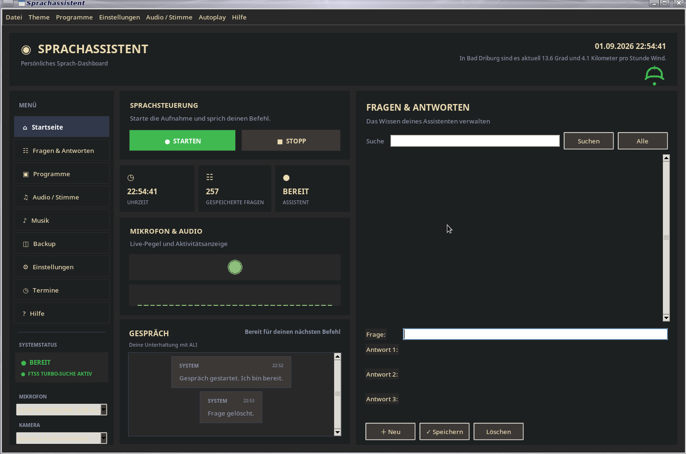

# Sprachassistent v5.1

Deutschsprachiger Sprachassistent von Goldisoft.

## Funktionen

- Sprachsteuerung und Sprachausgabe
- Chat-/Antwortfenster
- Websuche
- Sprachbefehl **„Websuche starten“**
- Speichern von Antworten
- Terminplaner / Erinnerungen
- weitere Funktionen der aktuellen Programmversion

## Screenshot




[Github Seite](https://github.com/Angonikro/Sprachassistent/)

## Installation

Die aktuelle Programmdatei ist eine Python-Anwendung.

Benötigte externe Python-Pakete:

```text
requests
SpeechRecognition
RapidFuzz
opencv-python
Pillow
```

Installation:

```bash
pip install -r requirements.txt
```

Eine konkrete Mindestversion von Python wird im Programmcode nicht ausdrücklich geprüft.

## Start

Nach der Installation der Abhängigkeiten:

```bash
python Sprachassistent.py
```

## Manuelle Websuche

Mit **„Websuche starten“** wird die manuelle Websuche gestartet.

Ablauf:

1. „Websuche starten“
2. Der Assistent fragt: „Was möchtest du suchen?“
3. Die nächste gesprochene Eingabe wird als vollständige Suchfrage verwendet.
4. Wenn ein Satz die Frage ausreichend beantwortet, wird die Antwort kurz gehalten.
5. Falls mehr Erklärung nötig ist, können mehrere passende Sätze verwendet werden.
6. Die Antwort kann anschließend gespeichert werden.

Die automatische Websuche bleibt davon getrennt.

## Plattformhinweis

Der aktuelle Quellcode enthält einen direkten Import von `fcntl`. `fcntl` ist nicht Bestandteil der normalen Windows-Python-Umgebung. Daher sollte die aktuelle Datei vor einer Windows-Veröffentlichung noch auf Plattformkompatibilität geprüft werden.

**Version 5.1 – By Goldisoft 2026**
